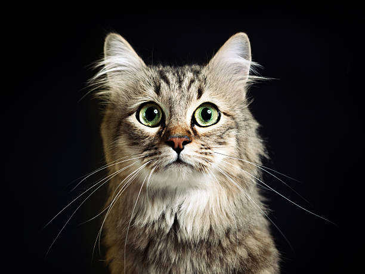
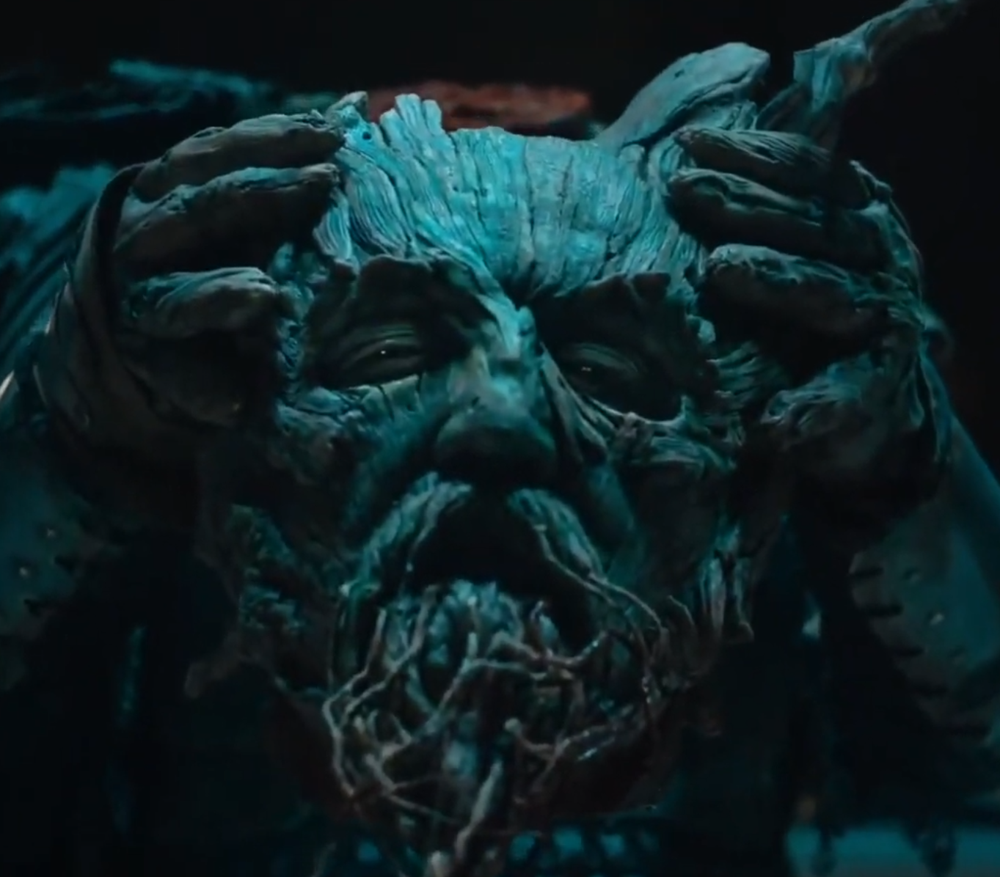
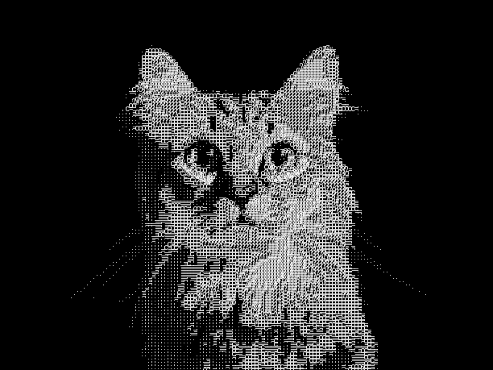
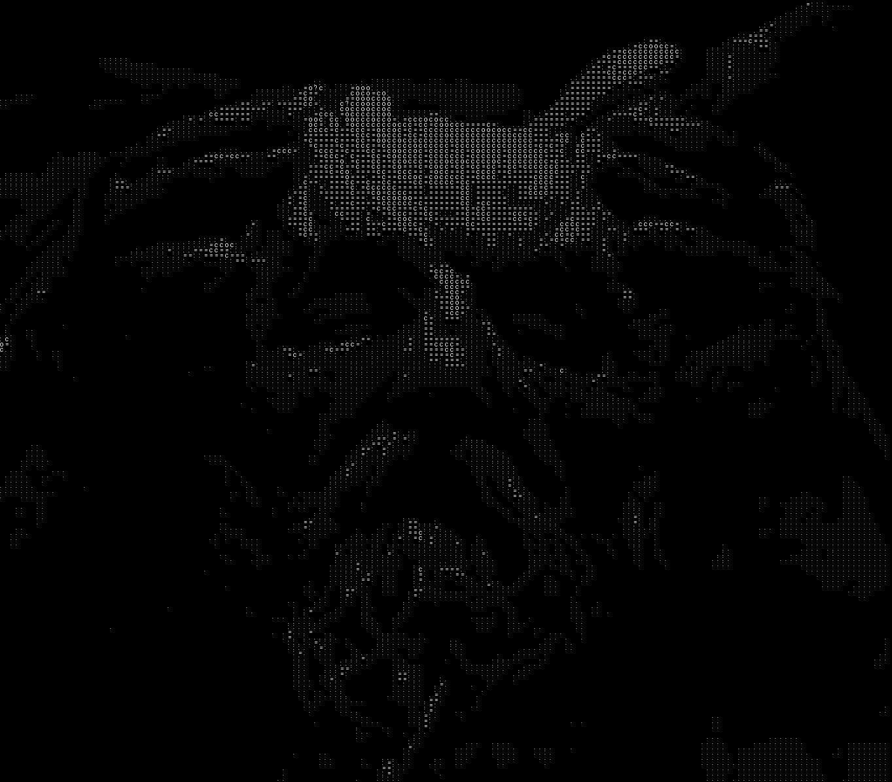

# ASCII_ART

This project is a creation of an ASCII art generator using Python and the Pillow library. The script takes an input image and processes it to create an ASCII art representation of the image by converting its pixels into corresponding ASCII characters based on their luminance.

### 1. How It Works

1. Transforming Images into Grayscale:  
        The input image is converted to grayscale, so it only has brightness values.

2. Scaling Down:
        The image is scaled down to a smaller size using a factor

3. ASCII Representation of Image:
        The input image is represented in ASCII using a predefined list of characters: [' ', '.', ':', '=', 'c', 'o', '?', '#', '%', '@']. Each character corresponds to a specific range of brightness, with ' ' representing the darkest and '@' representing the brightest regions. The luminance of each pixel is normalized to a range of [0, 1] and mapped to the corresponding character based on its brightness.

5. Creating the ASCII Art Image:
        A new blank image of the same size as the original is created to hold the ASCII art. ASCII characters are drawn onto the new image at positions corresponding to their scaled locations in the original image.

6. Output:
        The resulting ASCII art image is displayed.

### 2. example
##### input image (cat1.jpg):

  
  

##### Output: The generated ASCII art (ASCII Faktor 4):

  
  

### 3. How to Use
1. Clone the repository:
2. Install dependencies: Ensure that Pillow is installed with:    pip install Pillow
3. Place your input image: Put the image you want to convert into ASCII art into the same directory as your script, or note its full path if it is elsewhere.
4. Run the script: Navigate to the directory where ascii_art.py is located and run the script:   python ascii_art.py
5. Enter the name of your image: When prompted, enter the filename of your image (or the full path if it’s not in the same folder).
6. View the output: The script will generate ASCII art from your image and display it automatically.

### 1. Improvement

Create an outline using ASCII art and enhance it with more vibrant colors to make it more visually appealing.
